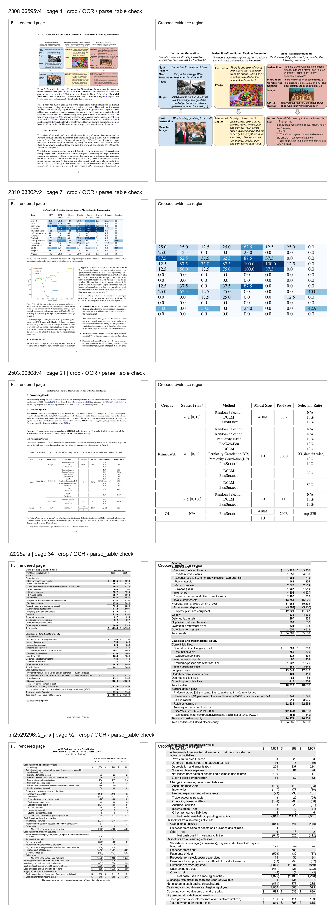
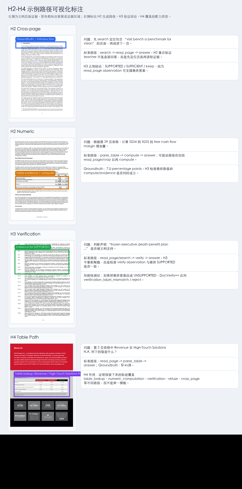

# DocWorldTrace H1-H5 展示报告

> 更新时间：2026-04-30  
> 展示重点：结果、数据、样例证据。  
> 核心结论：DocWorldTrace pilot 已验证“PDF -> 可交互 DocEnv -> 多步工具轨迹 -> 可验证轨迹 -> SFT 行为收益”的完整链路。H5 结果显示，trajectory SFT 明显优于 answer-only SFT，尤其是在真实 closed-loop DocEnv 中能主动调用工具，而不是直接回答。

---

## 1. 一句话结论

DocWorldTrace 的核心价值不是单纯抽取 PDF 文本，而是把静态 PDF 转换成可交互、可验证、可训练的文档智能体环境。

| Stage | 目标 | 结论 | 关键证据 |
|---|---|---:|---|
| H1 | PDF 能否变成稳定工具环境 | PASS | 5 篇 PDF，50 次标准工具调用全部成功 |
| H2 | Teacher 能否生成多步工具轨迹 | PASS | 80 条 rollout，格式、终止、调整后答案正确率均为 100% |
| H3 | DocVerify++ 能否验证/过滤轨迹 | PASS | 80/80 supported、sufficient、keep |
| H4 | 轨迹是否具备任务和路径多样性 | PASS | 覆盖 6 类任务、7 个核心工具、10 类工具序列 |
| H5 | 轨迹 SFT 是否优于 answer-only SFT | PASS | next-action: 98% vs 38%；closed-loop: 83.33% vs 33.33% |

---

## 2. 实验数据概览

### 2.1 H1 基础 PDF 数据

H1 使用 5 篇真实 PDF，包括论文和年报，覆盖普通文本、表格、长文档和图文混排。

| Document | Pages | Words | Table Pages | Type |
|---|---:|---:|---:|---|
| `2308.06595v4` | 28 | 5,816 | 6 | arXiv |
| `2310.03302v2` | 39 | 11,644 | 5 | arXiv |
| `2503.00808v4` | 24 | 7,160 | 8 | arXiv |
| `ti2025ars` | 140 | 62,127 | 66 | annual report |
| `tm2529296d2_ars` | 98 | 39,995 | 49 | annual report |

质量筛选结果：

| Metric | Result |
|---|---:|
| Document count | 5 |
| High quality | 4 |
| Medium quality | 1 |
| Low quality | 0 |

### 2.2 Diverse-PDF 扩展数据

后续 H2-H5 使用 diverse-PDF stress test，覆盖更多文档类型。

| Item | Value |
|---|---:|
| Seed count | 54 |
| PDF count | 14 |
| Teacher count | 3 |
| Rollouts | 162 |
| Task types | 6 |

任务分布：

| Task Type | Seed Count |
|---|---:|
| `unanswerable` | 14 |
| `text_lookup` | 12 |
| `verification` | 10 |
| `table_lookup` | 7 |
| `cross_page` | 6 |
| `numeric_computation` | 5 |

新增文档类型包括 Apple 10-K、EPA GHG inventory、FDA drug label、IRS Form 1040、NASA budget、NIST AI profile、SCOTUS opinion、USGS minerals summary、IPCC report 等。

---

## 3. H1：DocEnv 工具环境可行性

H1 不调用大模型，只验证工具环境是否可靠。

标准工具集合：

```text
overview / search / read_page / crop / ocr / parse_table / compute / verify / detect_layout
```

结果：

| Metric | Result |
|---|---:|
| Total tool calls | 50 |
| Successful calls | 50 |
| Success rate | 100% |
| Expectation checks | 100% |
| Retrieval checks | 100% |
| Cache checks | 100% |

展示图：每行对应一个 PDF 样本，左侧为整页渲染图，右侧为 crop/OCR/parse_table 人工核验区域。



结论：真实 PDF 已经可以被稳定转换为可操作环境，后续 H2-H5 的工具轨迹不是模拟日志，而是建立在真实 DocEnv 调用之上。

---

## 4. H2-H4：轨迹生成、验证与多样性

### 4.1 H2 Teacher Rollout 结果

H2 验证 teacher 是否能在 DocEnv 中产生多步工具轨迹。

| Metric | Result |
|---|---:|
| Rollout count | 80 |
| Format compliance | 100% |
| Proper termination | 100% |
| Adjusted answer correct | 100% |
| Direct answer rate | 0% |

扩展 diverse-PDF stress test：

| Metric | Result |
|---|---:|
| Count | 162 |
| Format compliance | 97.53% |
| Proper termination | 97.53% |
| Adjusted answer correct | 87.65% |
| Direct answer | 0% |
| Average steps | 3.228 |

解释：teacher 基本不会跳过工具直接回答，说明 DocEnv 轨迹确实包含过程监督信号。

### 4.2 H3 DocVerify++ 结果

H3 验证轨迹是否由文档证据支持，并过滤不可靠轨迹。

| Metric | Pilot Result |
|---|---:|
| Count | 80 |
| Supported | 80 |
| Sufficient | 80 |
| Keep | 80 |
| Keep rate | 100% |

扩展 diverse-PDF stress test：

| Metric | Result |
|---|---:|
| Count | 162 |
| Support rate | 85.80% |
| Sufficiency rate | 85.80% |
| Keep rate | 85.80% |
| Review rate | 0.62% |
| Reject rate | 13.58% |

解释：DocVerify++ 的作用是把 teacher 轨迹从“可用生成结果”变成“可审查、可过滤的训练数据”。

### 4.3 H4 多样性结果

H4 验证轨迹是否覆盖不同任务和工具路径，而不是只有单一 `read_page -> answer`。

| Metric | Pilot Result |
|---|---:|
| Task types | 6 |
| Core action coverage | 7 / 7 |
| Unique tool sequences | 10 |
| Search query diversity | pass |

扩展 diverse-PDF stress test：

| Metric | Result |
|---|---:|
| Unique seed count | 54 |
| Unique sequence count | 39 |
| Seed-level unique sequence ratio | 72.22% |
| Core action coverage | 7 / 7 |
| Full action coverage | 8 actions |
| Rule-based deviation rate | 54.32% |
| Unique search query ratio | 61.95% |

代表性工具路径：

| Pattern | Example Path | Capability |
|---|---|---|
| Text lookup | `read_page -> answer` | 单页文本定位 |
| Cross-page | `search -> read_page -> answer` | 检索 anchor page 后读取相邻页 |
| Table lookup | `read_page -> parse_table -> answer` | 表格结构化抽取 |
| Numeric computation | `parse_table -> compute -> answer` | 表格数值 + 计算 |
| Verification | `read_page -> verify -> answer` | 文档证据支持判断 |
| Refusal | `search -> read_page -> refuse` | 查证后拒答 |

### 4.4 H2-H4 展示样例

这组样例用于把 H2-H4 的抽象指标落到具体轨迹上：H2 看 teacher 是否会按任务调用工具，H3 看轨迹是否有证据支撑，H4 看不同任务是否触发不同工具路径。



## 5. H5：Trajectory SFT 行为收益

H5 是当前最关键的实验：同一个 Qwen3-VL base model，分别训练两个 LoRA adapter。

| Adapter | Supervision | 目标行为 |
|---|---|---|
| `answer_only_adapter` | 只监督最终 `answer/refuse` | 直接给最终答案 |
| `trajectory_adapter` | 监督下一步 DocEnv action | 学会 `search/read_page/parse_table/compute/verify/refuse/answer` |

### 5.1 SFT 数据

| Item | Value |
|---|---:|
| Base model | `Qwen3-VL-8B-Instruct` |
| Rollout count | 162 |
| Unique seed count | 54 |
| Train / eval rollouts | 144 / 18 |
| Answer-only train / eval samples | 144 / 18 |
| Trajectory train / eval samples | 427 / 50 |
| Trajectory train non-terminal target rate | 66.28% |

### 5.2 Training Stability

| Adapter | Final Train Loss | Final Eval Loss |
|---|---:|---:|
| `answer_only_adapter` | 0.5899 | 0.2511 |
| `trajectory_adapter` | 0.2766 | 0.1927 |

### 5.3 Next-Action Eval

next-action eval 是 teacher-forcing 风格：给模型已有 observation history，看它能否预测下一步 action。

| Evaluation | Count | Format Valid | Action Match | Generated Non-Terminal | Target Non-Terminal Covered |
|---|---:|---:|---:|---:|---:|
| answer-only on answer-only eval | 18 | 100% | 100% | 0% | 0% |
| answer-only on trajectory eval | 50 | 100% | 38% | 14% | 21.88% |
| trajectory on trajectory eval | 50 | 100% | 98% | 66% | 100% |

关键对比：

| Model Condition | Action Match | Generated Non-Terminal | Target Non-Terminal Covered |
|---|---:|---:|---:|
| answer-only adapter | 38% | 14% | 21.88% |
| trajectory adapter | 98% | 66% | 100% |

结论：trajectory SFT 不是只学会 JSON 格式，而是显著学会了中间工具 action。

### 5.4 Closed-Loop DocEnv Eval

closed-loop eval 更严格：模型必须自己输出 action，DocEnv 执行真实工具，然后 observation 再反馈给模型。

| Adapter | Count | Format Valid | Proper Termination | Adjusted Correct | Non-Terminal Tool Use | Acceptable Path | Direct Answer |
|---|---:|---:|---:|---:|---:|---:|---:|
| `answer_only_adapter` | 6 | 83.33% | 83.33% | 33.33% | 0% | 0% | 83.33% |
| `trajectory_adapter` | 6 | 100% | 83.33% | 83.33% | 100% | 83.33% | 0% |

trajectory 相对 answer-only 的提升：

| Metric | Delta |
|---|---:|
| Adjusted answer correct | +50.00 pp |
| Non-terminal tool use | +100.00 pp |
| Acceptable path | +83.33 pp |
| Direct answer | -83.33 pp |

结论：在真实闭环环境中，trajectory adapter 会主动调用工具；answer-only adapter 则基本直接回答。这是 H5 最强证据。

---

## 6. 当前问题与 V3 数据补强

当前主要短板不是 H1-H4 基础可行性，而是 H5 中的拒答停止策略。

失败样例：

```text
nasa_fy2025_budget_summary__refuse__generic
trajectory adapter path:
search -> search -> search -> search -> search -> search -> search -> search
result:
budget_exhausted
```

问题解释：模型已经学会“先搜索”，但没有学会“搜索不到后停止并拒答”。

### V3 Refuse-Augmented Seeds

为了解决该问题，新增 V3 refuse-augmented seed。

| Item | Value |
|---|---:|
| Source seed file | `data/h2/seeds/diverse_pdf_seeds_v2.jsonl` |
| New seed file | `data/h2/seeds/diverse_pdf_seeds_v3_refuse_augmented.jsonl` |
| Review file | `data/h2/seeds/diverse_pdf_seeds_v3_refuse_augmented.review.md` |
| Original seed count | 54 |
| New seed count | 68 |
| Original unanswerable seeds | 14 |
| New unanswerable seeds | 28 |

V3 设计重点：

| Change | Purpose |
|---|---|
| 替换重复 private-phone 模板 | 避免拒答数据单一 |
| 增加私有凭证、文档外事实、未披露预测、医疗建议、法律/政策建议、金融建议 | 覆盖更真实的不可回答场景 |
| `negative_search_queries` | 引导搜索负证据 |
| `max_negative_searches=2` | 防止无限 search |
| `read_top_result_pages=true` | 形成 page-level negative evidence |
| `refuse_after_negative_evidence=true` | 明确查不到后应拒答 |

V3 需要人工审查后再进入下一轮 H2-H5。

---

## 7. 最终展示结论

DocWorldTrace 当前 pilot 已经支撑三个核心主张：

1. **环境主张**：静态 PDF 可以被转换成可交互、可复现的 DocEnv。
2. **数据主张**：DocEnv 可以产生多步、可验证、多样化的文档智能体轨迹。
3. **训练主张**：这些轨迹作为 SFT 信号，能显著提升 student model 的工具调用行为。

当前不应过度声明“大规模泛化已完成”。最准确的表述是：

```text
DocWorldTrace 已完成 pilot-scale end-to-end verification。
下一步需要用 V3 refuse-augmented seeds 扩大 held-out closed-loop eval，
并重点修复 unanswerable 场景中的重复 search / 不终止问题。
```
