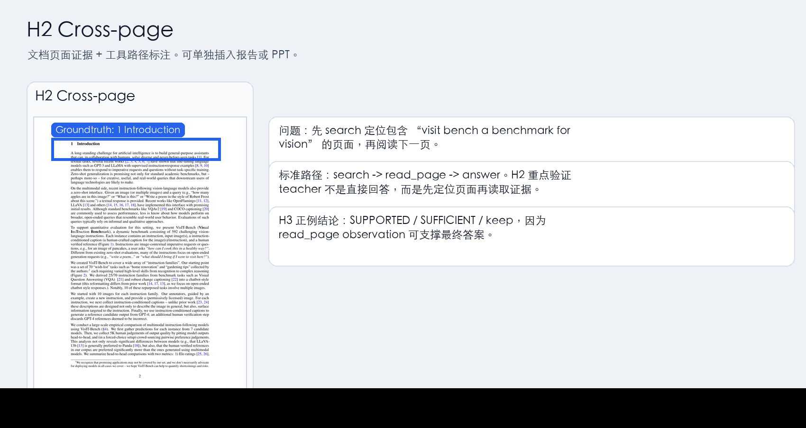
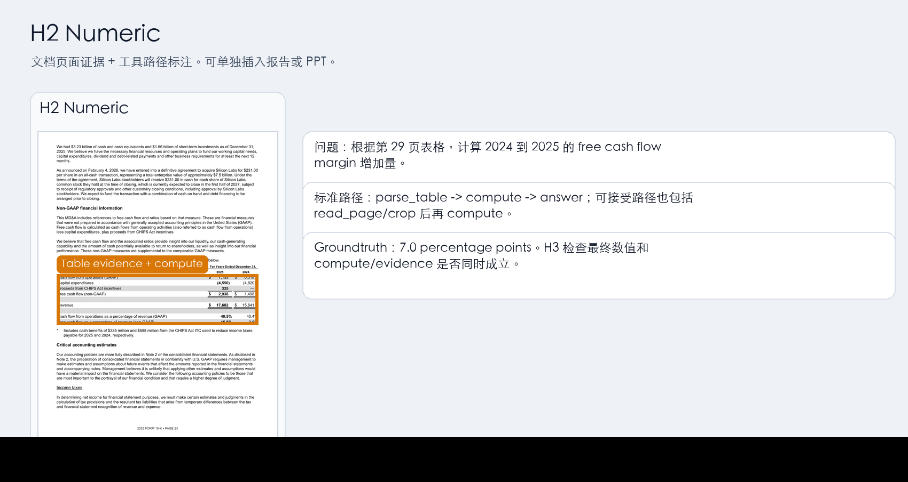
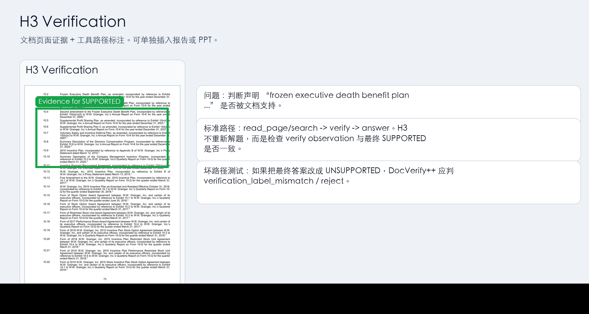
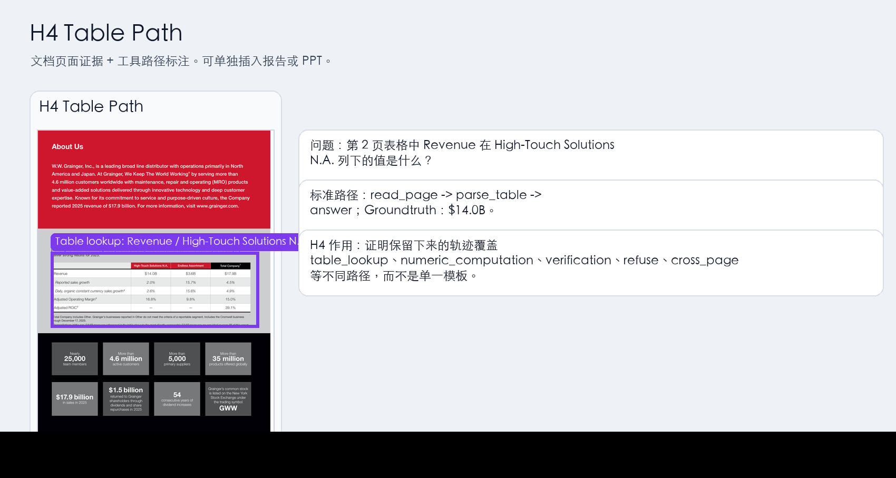

# H1-H5 Pilot Experiment Summary

> 汇总时间：2026-04-30  
> 范围：DocWorldTrace pilot H1-H5，包含 H5 Qwen3-VL SFT 行为收益实验。  
> 核心结论：H1-H5 当前均通过 pilot 验收标准；最强证据来自 H5，trajectory SFT 在 next-action 与 closed-loop 两种评测中都显著优于 answer-only SFT。  
> 当前重点：扩大 held-out 测试集，并补强 unanswerable/refuse 的“有限搜索后停止拒答”能力。

---

## Overall Conclusion

| Hypothesis | Experiment | Status | Main Evidence |
|---|---|---:|---|
| H1 | DocEnv 工具环境可行性 | PASS | 5 篇 PDF、50 次标准工具调用全部成功 |
| H2 | Teacher 可生成多步工具轨迹 | PASS | 80 条 rollout 格式合规率、正常终止率、调整后答案正确率均为 100% |
| H3 | DocVerify++ 可过滤/保留 supported 轨迹 | PASS | 80/80 轨迹 supported、sufficient、keep |
| H4 | 轨迹具有任务与工具路径多样性 | PASS | 覆盖 6 类任务、7/7 核心工具、10 类工具序列 |
| H5 | Trajectory SFT 是否优于 answer-only SFT | PASS | next-action eval: 98% vs 38% action match；closed-loop eval: 83.33% vs 33.33% adjusted correct |

## Key Takeaways

1. **DocEnv 可行**：H1 证明真实 PDF 可以稳定转成可交互环境，基础工具链没有阻塞。
2. **轨迹可生成、可验证、可多样化**：H2-H4 证明 teacher 能产生多步工具路径，DocVerify++ 能过滤路径，任务/工具覆盖足够支撑 pilot。
3. **SFT 信号有效**：H5 证明 trajectory SFT 不只是格式学习；在真实 DocEnv closed-loop 中，trajectory adapter 能主动调用工具，而 answer-only adapter 基本直接回答。
4. **当前最大短板是拒答停止策略**：trajectory adapter 在 unanswerable seed 上出现重复 `search` 到 budget exhausted，没有及时 `refuse`。
5. **已补强数据**：新增 V3 refuse-augmented seeds，将 unanswerable 从 14 条扩展到 28 条，并加入 bounded negative-evidence hints，供人工审查后进入下一轮 H2-H5。

## Current Bottleneck

| Bottleneck | Evidence | Current Fix |
|---|---|---|
| Held-out 测试集偏小 | H5 closed-loop eval 只有 6 个 held-out seed | 下一轮用 V3 扩充 seed 后重新划分 train/eval |
| Unanswerable 不会停止 | `nasa_fy2025_budget_summary__refuse__generic` 连续 `search` 8 次后 budget exhausted | V3 增加多样化 refuse seed 与 `max_negative_searches=2` hints |
| `required_tools` 指标偏严格 | 合理短路径如 `parse_table -> answer` 不一定覆盖全部 required tools | 已增加 `acceptable_path_rate`，更贴合 seed 设计 |
| H5 仍是 pilot 规模 | 证明工具行为收益，但不能外推为大规模泛化 | 后续需要 larger held-out closed-loop eval |

---

## H1: DocEnv 工具环境可行性

### Goal

验证真实 PDF 是否可以被建模为稳定、可复现的交互式文档环境。H1 不调用大模型，重点验证工具本身：

```text
overview / search / read_page / crop / ocr / parse_table / compute / verify / detect_layout
```

### Data

使用 5 篇 PDF：

| Document | Pages | Words | Table Pages | Type |
|---|---:|---:|---:|---|
| `2308.06595v4` | 28 | 5,816 | 6 | arXiv |
| `2310.03302v2` | 39 | 11,644 | 5 | arXiv |
| `2503.00808v4` | 24 | 7,160 | 8 | arXiv |
| `ti2025ars` | 140 | 62,127 | 66 | annual report |
| `tm2529296d2_ars` | 98 | 39,995 | 49 | annual report |

Raw data quality screening:

| Metric | Result |
|---|---:|
| Document count | 5 |
| High quality | 4 |
| Medium quality | 1 |
| Low quality | 0 |

### Method

每篇文档执行 10 个标准工具调用：

```text
overview_doc
search_primary_page
search_primary_page_cached
read_primary_page
crop_evidence_region
ocr_evidence_region
parse_table_primary_table
compute_sanity_check
verify_supported_claim
detect_layout_primary_page
```

同时检查：

```text
status success
expected text/table/numeric output
retrieval target page
cache hit
support label
```

### Result

| Metric | Result |
|---|---:|
| Total standard calls | 50 |
| Successful calls | 50 |
| Tool success rate | 100% |
| Expectation checks | 105 / 105 |
| Expectation pass rate | 100% |
| Retrieval checks | 10 / 10 |
| Retrieval pass rate | 100% |
| Cache checks | 5 / 5 |
| Cache pass rate | 100% |

Per-document reports:

| Document | Calls | Success Rate | Expectation Rate | Retrieval Rate | Cache Rate |
|---|---:|---:|---:|---:|---:|
| `2308.06595v4` | 10 | 100% | 100% | 100% | 100% |
| `2310.03302v2` | 10 | 100% | 100% | 100% | 100% |
| `2503.00808v4` | 10 | 100% | 100% | 100% | 100% |
| `ti2025ars` | 10 | 100% | 100% | 100% | 100% |
| `tm2529296d2_ars` | 10 | 100% | 100% | 100% | 100% |

### Manual Review

人工核验对象包括：

```text
整页渲染图
crop 局部图
OCR 输出文本
parse_table 输出表格
```

展示图：

```text
data/reports/h1_manual_review/contact_sheet.png
```


### H1 Decision

H1 通过。DocEnv 在 5 篇真实 PDF 上能够稳定执行核心工具调用，支持进入 H2。

---

## H2: Teacher 多步轨迹生成可行性

### Goal

验证强模型 teacher 是否能在 DocEnv 中按照工具协议逐步解决文档问题，而不是直接 answer-only。

H2 的核心输出是 ReAct-style trajectory：

```text
question -> tool call -> observation -> next tool call -> ... -> answer/refuse
```

### Data

使用 20 个 H2 seed，覆盖 6 类任务：

| Task Type | Rollout Count |
|---|---:|
| text_lookup | 20 |
| cross_page | 16 |
| unanswerable | 16 |
| numeric_computation | 12 |
| table_lookup | 8 |
| verification | 8 |

Teacher models:

```text
gpt-4o-2024-11-20
gemini-2.5-flash
```

Rollout 设置：

```text
20 seeds × 2 teachers × 2 repeats = 80 trajectories
```

### Method

每条轨迹给 teacher 提供：

```text
tool API specification
ReAct JSON action protocol
task metadata
document overview
task-specific hints
```

DocEnv 执行每一步工具调用，teacher 只能基于真实 observation 继续下一步。

终止动作：

```text
answer
refuse
```

非终止工具：

```text
search / read_page / crop / ocr / parse_table / compute / verify
```

### Result: Answer and Format Metrics

| Metric | Result |
|---|---:|
| Count | 80 |
| Format compliance rate | 100% |
| Proper termination rate | 100% |
| Strict answer correct rate | 81.25% |
| Adjusted answer correct rate | 100% |
| Mean answer F1 | 84.25% |
| Average steps | 2.925 |
| Verify usage rate | 10% |
| Refuse usage rate | 20% |
| Direct answer rate | 0% |

By teacher:

| Teacher | Count | Format | Proper Termination | Adjusted Correct | Direct Answer |
|---|---:|---:|---:|---:|---:|
| `dmxapi_gemini_2_5_flash` | 40 | 100% | 100% | 100% | 0% |
| `dmxapi_gpt4o_2024_11_20` | 40 | 100% | 100% | 100% | 0% |

By task type:

| Task Type | Count | Adjusted Correct | Avg Steps |
|---|---:|---:|---:|
| cross_page | 16 | 100% | 3.5 |
| unanswerable | 16 | 100% | 3.0625 |
| text_lookup | 20 | 100% | 2.0 |
| verification | 8 | 100% | 3.375 |
| numeric_computation | 12 | 100% | 3.1667 |
| table_lookup | 8 | 100% | 3.0 |

The strict answer correct rate is lower than adjusted correctness because exact/F1 matching under-counts semantically correct table/cross-page/text answers. The adjusted evaluator and DocVerify++ results resolve this mismatch.

### Result: Path Review

| Metric | Result |
|---|---:|
| Evidence path OK rate | 100% |
| Acceptable path OK rate | 100% |
| Proper termination rate | 100% |
| Expected terminal rate | 100% |
| Non-terminal tool use rate | 100% |
| Successful evidence observation rate | 100% |
| Strict path OK rate | 81.25% |

Strict path failures are all `missing_required_tool` under a narrow required-tool definition. They are not evidence failures: all trajectories satisfy acceptable path and evidence observation checks.

### Concrete H2 Trajectory Examples

Annotated visual examples:


| Task | Query Summary | Tool Path | Final Output | Why It Matters |
|---|---|---|---|---|
| Cross-page | Find the page about `"visit bench a benchmark for vision"`, then inspect the following page. | `search -> read_page -> answer` | `1 Introduction` | Shows that the agent uses search to locate an anchor page and then reads the target page before answering. |
| Numeric computation | Compute the percentage-point increase in free cash flow margin from 2024 to 2025. | `read_page -> crop -> compute -> answer` | `7 percentage points` | Shows that the agent can inspect a table region and delegate arithmetic to `compute` instead of doing unsupported mental math. |
| Unanswerable/refusal | Ask for a private mobile phone number not provided by the document. | `search -> read_page -> refuse` | Refuses with evidence-based reason | Shows that `refuse` is not direct refusal; the agent first searches and reads candidate pages. |
| Verification | Check whether `"10 2 frozen executive death benefit plan as amended incorporated"` is supported. | `read_page -> verify -> answer` | `SUPPORTED` | Shows explicit use of `verify` before final claim-support answer. |

Example detailed traces:

```text
Cross-page example:
query: Use search to find the page about "visit bench a benchmark for vision".
path: search("visit bench a benchmark for vision") -> read_page([2]) -> answer("1 Introduction")
evidence: page 2 summary = "1 Introduction"

Numeric example:
query: compute free cash flow margin increase from 2024 to 2025
path: read_page([29]) -> crop(page=29, bbox=[48.96, 365.70001, 561.96002, 493.95001]) -> compute(16.6 - 9.6) -> answer
result: 7 percentage points

Refusal example:
query: private mobile phone number of the first author or CEO
path: search("phone number OR contact OR mobile number") -> read_page([9, 16, 19]) -> refuse
result: document does not provide private contact information

Verification example:
query: is the claim supported?
path: read_page([81]) -> verify(claim, evidence_refs=[{"page": 81}]) -> answer("SUPPORTED")
verify result: SUPPORTED / SUFFICIENT
```

### H2 Decision

H2 通过。Teacher 能稳定生成格式合规、非直接回答、证据可追踪的多步工具轨迹。

---

## H3: DocVerify++ 轨迹验证过滤

### Goal

验证 DocVerify++ 是否可以判断 H2 轨迹的最终答案是否被文档证据支持、证据是否充分，以及轨迹是否应进入训练数据。

### Method

对 H2 的 80 条轨迹运行 DocVerify++：

```text
final answer/refuse
evidence refs
tool observations
claim support
sufficiency
filter decision
```

### Result

| Metric | Result |
|---|---:|
| Count | 80 |
| Support rate | 100% |
| Sufficiency rate | 100% |
| Keep rate | 100% |
| Review rate | 0% |
| Reject rate | 0% |
| Adjusted answer correct rate | 100% |
| Mean quality score | 0.9933 |

Support labels:

| Label | Count |
|---|---:|
| SUPPORTED | 80 |

Sufficiency labels:

| Label | Count |
|---|---:|
| SUFFICIENT | 80 |

Filter decisions:

| Decision | Count |
|---|---:|
| keep | 80 |

Failure taxonomy:

| Failure Type | Count |
|---|---:|
| none | 80 |

By teacher:

| Teacher | Count | Support | Sufficiency | Keep |
|---|---:|---:|---:|---:|
| `dmxapi_gemini_2_5_flash` | 40 | 100% | 100% | 100% |
| `dmxapi_gpt4o_2024_11_20` | 40 | 100% | 100% | 100% |

### Concrete H3 Verification Examples

| Seed | Claim Checked by DocVerify++ | Evidence Used | Support | Sufficiency | Decision |
|---|---|---|---|---|---|
| `2308.06595v4__cross__p1_p2` | `1 Introduction` | search snippets + page 2 read_page evidence | SUPPORTED | SUFFICIENT | keep |
| `ti2025ars__numeric_free_cash_flow_margin_change_p29` | computed answer is `7.0 percentage points` | page 29 table/crop evidence + compute result | SUPPORTED | SUFFICIENT | keep |
| `2310.03302v2__refuse__generic` | requested private phone number is not provided by the document | negative search/read evidence | SUPPORTED | SUFFICIENT | keep |
| `tm2529296d2_ars__verify__p81` | claim about frozen executive death benefit plan is supported | page 81 evidence + verify result | SUPPORTED | SUFFICIENT | keep |

These examples show that H3 is not only checking final answer strings. It checks whether the trajectory contains enough document-grounded evidence to justify answer, computation, verification, or refusal.

### H3 Negative-Control Experiment

为了验证 DocVerify++ 不是只会保留正例，本轮在 80 条 H2 正常轨迹上构造了负例轨迹。负例不重新调用 teacher model，而是在已有轨迹上注入可控错误，用来测试 verifier 是否能发现 unsupported / insufficient trajectory。

负例构造：

| Negative Type | Count | Meaning |
|---|---:|---|
| `wrong_final_answer` | 64 | 保留工具调用路径，但把最终答案改错 |
| `missing_evidence_observations` | 64 | 删除关键 evidence observation，使答案缺少可审查证据 |
| `false_answer_for_unanswerable` | 16 | 对本应 refuse 的问题强行给出虚假答案 |
| Total | 144 | 由 80 条 H2 正例派生 |

负例验证结果：

| Metric | Result |
|---|---:|
| Negative count | 144 |
| Caught bad count | 144 |
| Caught bad rate | 100% |
| Missed keep count | 0 |
| Missed keep rate | 0% |
| Reject decisions | 128 |
| Review decisions | 16 |

Failure taxonomy:

| Failure Type | Count | Interpretation |
|---|---:|---|
| `missing_evidence` | 64 | 轨迹缺少支撑答案的文档观察 |
| `answer_mismatch` | 36 | 最终答案与 reference 不一致 |
| `insufficient_negative_evidence` | 16 | 拒绝题缺少足够 negative evidence |
| `verification_label_mismatch` | 8 | verify 结论与 expected verification label 不一致 |
| `numeric_mismatch` | 12 | 数值答案错误 |
| `table_value_mismatch` | 8 | 表格证据存在，但最终表格答案错误 |

人工审查输出：

| File | Purpose |
|---|---|
| `data/h3/negative_v4/negative_manual_review.md` | 面向人工阅读的负例审查清单 |
| `data/h3/negative_v4/negative_manual_review.jsonl` | 逐条负例、路径、verifier 判定和错误类型 |
| `data/h3/negative_v4/negative_manual_labels_template.jsonl` | 人工标注模板，可记录 accept/reject/review |
| `data/h3/negative_v4/negative_docverify_review.md` | 完整 DocVerify++ 负例判定报告 |

这次负例测试还暴露并修复了两个 verifier 规则问题：

| Fixed Issue | Why It Matters |
|---|---|
| verify label exact matching | 避免把 `UNSUPPORTED` 当成包含 `SUPPORTED` 的正确标签 |
| table final-answer matching | 避免表格 evidence 中有正确值时，错误 final answer 仍被误判为 supported |

### H3 Decision

H3 通过。正例侧，80/80 条 H2 轨迹被判定为 `SUPPORTED / SUFFICIENT / keep`。负例侧，144/144 条注入错误的轨迹被 `reject` 或 `review` 捕获，没有错误轨迹被误保留为 `keep`。这说明当前 DocVerify++ 同时具备保留有效轨迹和拦截明显坏轨迹的能力。

---

## H4: 轨迹多样性分析

### Goal

验证 H2/H3 保留下来的轨迹是否不是单一模板，而是覆盖不同任务类型、工具组合和推理路径。

### Method

对 80 条 H2 trajectory 统计：

```text
unique action sequence
action coverage
core pilot action coverage
step count distribution
search query diversity
task type × tool path
```

### Result

| Metric | Result |
|---|---:|
| Count | 80 |
| H4-lite passed | true |
| Unique sequence count | 10 |
| Unique sequence ratio | 12.5% |
| Action coverage | 8 / 10 |
| Core pilot action coverage | 7 / 7 |
| Average step count | 2.925 |
| Search calls | 36 |
| Unique search query count | 19 |
| Unique search query ratio | 52.78% |
| Unique seed-query pair ratio | 58.33% |

Covered task types:

```text
cross_page
numeric_computation
table_lookup
text_lookup
unanswerable
verification
```

Covered core actions:

```text
answer
compute
parse_table
read_page
refuse
search
verify
```

Additional action used:

```text
crop
```

Top tool sequences:

| Tool Sequence | Count |
|---|---:|
| `read_page -> answer` | 20 |
| `search -> read_page -> refuse` | 15 |
| `parse_table -> compute -> answer` | 10 |
| `search -> read_page -> answer` | 8 |
| `search -> read_page -> read_page -> answer` | 8 |
| `read_page -> parse_table -> answer` | 8 |
| `read_page -> verify -> answer` | 5 |
| `search -> read_page -> verify -> answer` | 3 |
| `read_page -> crop -> compute -> answer` | 2 |
| `search -> search -> read_page -> refuse` | 1 |

### Concrete H4 Diversity Examples

| Pattern | Example Seed | Typical Path | Covered Capability |
|---|---|---|---|
| Direct page lookup after page target is known | `2308.06595v4__text__p7` | `read_page -> answer` | single-page textual grounding |
| Cross-page retrieval | `2308.06595v4__cross__p1_p2` | `search -> read_page -> answer` | locating relevant pages by search |
| Multi-page follow-up | cross-page seeds | `search -> read_page -> read_page -> answer` | anchor page plus following page inspection |
| Table extraction | `tm2529296d2_ars__table__p2` | `read_page -> parse_table -> answer` | structured table lookup |
| Numeric reasoning | `ti2025ars__numeric_free_cash_flow_margin_change_p29` | `parse_table -> compute -> answer` or `read_page -> crop -> compute -> answer` | table/crop evidence plus arithmetic |
| Verification | `tm2529296d2_ars__verify__p81` | `read_page -> verify -> answer` | claim support checking |
| Evidence-based refusal | `2310.03302v2__refuse__generic` | `search -> read_page -> refuse` | unanswerable detection with negative evidence |

### Interpretation

The raw unique sequence ratio is only 12.5% because each seed is repeated across two teachers and two runs. H4-lite therefore emphasizes task coverage, core action coverage, task-specific path separation, and search query diversity rather than requiring every repeated rollout to have a unique path.

### H4 Decision

H4 通过。当前轨迹覆盖 6 类任务、7 个核心动作和 10 类工具序列，足以作为 pilot-stage process data。

---

## H5: Qwen3-VL SFT 轨迹监督收益验证

### Goal

验证 H2-H4 产生的工具轨迹是否能作为 SFT 监督信号，让 student model 学会输出 DocEnv action。H5 的对照不是不同模型，而是同一个 Qwen3-VL base model 上的两种监督方式：

```text
answer-only SFT: 只监督最终 answer/refuse
trajectory SFT: 监督 search/read_page/parse_table/compute/verify/refuse/answer 等逐步 action
```

### Data And Setup

| Item | Value |
|---|---:|
| Base model | `Qwen3-VL-8B-Instruct` |
| SFT method | LoRA SFT |
| SFT data dir | `data/h5/sft_diverse_v2` |
| Run dir | `runs/h5_qwen3_vl_diverse_v2` |
| Training log | `logs/h5_qwen3_vl_20260429_175133.log` |
| Rollout count | 162 |
| Unique seed count | 54 |
| Train / eval rollouts | 144 / 18 |
| Answer-only train / eval samples | 144 / 18 |
| Trajectory train / eval samples | 427 / 50 |
| Trajectory train non-terminal target rate | 66.28% |
| Trajectory core tool coverage | `answer`, `compute`, `parse_table`, `read_page`, `refuse`, `search`, `verify` |

本地同步的 SFT summary 记录为 `docverify=null, keep_all=true`。因此当前 H5 结论定位为 pilot 行为收益验证：它证明 trajectory supervision 能让模型学习工具 action 格式和路径，但还不是最终 DocVerify++ 过滤版的大规模训练结论。

### Method

两个 adapter 使用相同 base model 和相同 held-out split：

| Adapter | Training Target | Expected Behavior |
|---|---|---|
| `answer_only_adapter` | 只输出终止动作 `answer/refuse` | 擅长直接回答，但不应稳定产生中间工具 action |
| `trajectory_adapter` | 输出下一步 DocEnv action | 应能在轨迹 prompt 下选择 `search/read_page/parse_table/compute/verify/refuse/answer` |

评测分为 4 个组合：

| Evaluation | Purpose |
|---|---|
| answer-only on answer-only eval | 检查 answer-only adapter 是否学会最终答案格式 |
| answer-only on trajectory eval | 检查 answer-only adapter 是否会自发使用工具路径 |
| trajectory on answer-only eval | 检查 trajectory adapter 是否适配纯 answer-only prompt |
| trajectory on trajectory eval | H5 主评测：检查 trajectory adapter 是否学会工具 action |

### Training Stability

| Adapter | Final Train Loss | Final Eval Loss | Observation |
|---|---:|---:|---|
| `answer_only_adapter` | 0.5899 | 0.2511 | loss 正常下降，终止动作格式稳定 |
| `trajectory_adapter` | 0.2766 | 0.1927 | loss 正常下降，trajectory prompt 下 action 学习更充分 |

### Evaluation Result

| Evaluation | Count | Format Valid | Action Match | Generated Non-Terminal | Target Non-Terminal Covered |
|---|---:|---:|---:|---:|---:|
| answer-only on answer-only eval | 18 | 100% | 100% | 0% | 0% |
| answer-only on trajectory eval | 50 | 100% | 38% | 14% | 21.88% |
| trajectory on answer-only eval | 18 | 100% | 16.67% | 0% | 0% |
| trajectory on trajectory eval | 50 | 100% | 98% | 66% | 100% |

关键对比是同一组 `trajectory_eval`：

| Model Condition | Action Match | Generated Non-Terminal | Target Non-Terminal Covered |
|---|---:|---:|---:|
| answer-only adapter | 38% | 14% | 21.88% |
| trajectory adapter | 98% | 66% | 100% |

### Closed-Loop DocEnv Result

在服务器上进一步运行真实闭环评测：

```text
CUDA_VISIBLE_DEVICES=1 bash scripts/run_h5_qwen3_vl_closed_loop.sh
```

这一步不再使用 gold observation。模型必须自己输出 action，DocEnv 执行真实工具，再把 observation 返回给模型。日志文件为：

```text
logs/h5_closed_loop_20260429_234926.log
```

本次 closed-loop 使用 H5 held-out eval split，每个 adapter 6 条 seed，共 12 条交互轨迹。

| Adapter | Count | Format Valid | Proper Termination | Adjusted Correct | Non-Terminal Tool Use | Required Tool Coverage | Acceptable Path | Direct Answer |
|---|---:|---:|---:|---:|---:|---:|---:|---:|
| `answer_only_adapter` | 6 | 83.33% | 83.33% | 33.33% | 0% | 0% | 0% | 83.33% |
| `trajectory_adapter` | 6 | 100% | 83.33% | 83.33% | 100% | 50% | 83.33% | 0% |

trajectory 相对 answer-only 的闭环提升：

| Metric | Delta |
|---|---:|
| Adjusted answer correct | +50.00 pp |
| Non-terminal tool use | +100.00 pp |
| Required tool coverage | +50.00 pp |
| Acceptable path | +83.33 pp |
| Direct answer | -83.33 pp |

逐条结果显示，answer-only adapter 基本直接 `answer/refuse`，例如 cross-page、verification、table lookup 都没有先调用工具；trajectory adapter 则生成了真实工具路径：

| Seed | Trajectory Adapter Path | Final Result |
|---|---|---|
| `2310.03302v2__cross__p1_p2` | `search -> read_page -> read_page -> answer` | correct |
| `irs_2025_form_1040__verify__p2` | `read_page -> verify -> answer` | correct |
| `ti2025ars__table__p7` | `parse_table -> answer` | correct |
| `tm2529296d2_ars__numeric__p2` | `parse_table -> compute -> answer` | correct |
| `tm2529296d2_ars__text__p27` | `read_page -> answer` | correct |
| `nasa_fy2025_budget_summary__refuse__generic` | repeated `search` until budget exhausted | failed |

Closed-loop 结论：H5 通过小规模闭环验证。trajectory SFT 不只是在 teacher-forcing next-action eval 中匹配 action，也能在真实 DocEnv observation loop 中显著降低 direct answer，并主动调用 `search/read_page/parse_table/compute/verify`。按 `acceptable_paths` 判断，trajectory adapter 达到 83.33% 路径合规；唯一不合规的是 unanswerable 任务中重复 search、不主动转入 `read_page/refuse`，需要在下一版 prompt 或数据中强化停止/拒答策略。

### Interpretation

H5 的主要结果成立：只训练最终答案的 adapter 在 trajectory prompt 下大多仍倾向于直接 `answer/refuse`，无法稳定复现中间工具调用；trajectory adapter 则能覆盖所有目标非终止工具步骤，并在 held-out trajectory eval 上达到 98% action match。

`trajectory_on_answer_only_eval` 的 16.67% 不是 H5 失败点，而是说明 adapter 对 prompt style 有明显专门化：trajectory adapter 学到的是“下一步工具 action”策略，不是纯 answer-only 输出策略。新增 closed-loop 结果进一步支持 H5，但当前闭环样本只有 6 条 held-out seed，因此 H5 的主张仍应表述为 pilot-scale evidence，不能直接外推为大规模完整 QA 泛化结论。

### H5 Decision

H5 通过 pilot 验收。当前结果足以支撑：DocWorldTrace 生成的轨迹不仅可验证、可多样化，而且能作为 SFT 信号显著改变 student model 的工具调用行为；在小规模 closed-loop DocEnv eval 中，trajectory adapter 也明显优于 answer-only adapter。后续需要扩大 closed-loop eval 的 seed 数量，并重点修复 unanswerable 场景的重复 search / 不终止问题。

---

## V3 Refuse-Augmented Seed Update

H5 closed-loop 暴露出的主要失败不是表格或数值，而是拒答任务中的停止策略：模型已经学会“继续查”，但没有学会“查不到后停止并拒答”。因此新增 V3 seed 不是为了整体扩大所有任务，而是专门补强 `unanswerable/refuse`。

| Item | Value |
|---|---:|
| Source seed file | `data/h2/seeds/diverse_pdf_seeds_v2.jsonl` |
| New seed file | `data/h2/seeds/diverse_pdf_seeds_v3_refuse_augmented.jsonl` |
| Review file | `data/h2/seeds/diverse_pdf_seeds_v3_refuse_augmented.review.md` |
| Original seed count | 54 |
| New seed count | 68 |
| Original unanswerable seeds | 14 |
| New unanswerable seeds | 28 |

V3 的核心变化：

| Change | Purpose |
|---|---|
| 替换重复的 private-phone 模板 | 避免 refuse 数据过于单一 |
| 增加 document-external facts / private credentials / undisclosed forecast / medical advice / legal-policy advice / financial advice | 覆盖更真实的不可回答场景 |
| 加入 `negative_search_queries` | 引导模型先找负证据 |
| 加入 `max_negative_searches=2` | 避免 closed-loop 中无限重复 search |
| 加入 `read_top_result_pages=true` | 让拒答有 page-level negative evidence |
| 加入 `refuse_after_negative_evidence=true` | 明确查不到后应转入 `refuse` |

V3 人工检查重点：

1. 每条 refuse query 是否确实不能从 PDF 中回答。
2. groundtruth 是否应为 `REFUSE`。
3. query 是否自然、合理，不是过度人为构造。
4. 是否存在某些 PDF 实际披露了该信息，导致不该拒答。
5. 是否需要保留医学/法律/金融建议类 query；这些能增强现实性，但报告中要说明其目的是 document-grounded refusal，不是安全评测。

V3 暂不直接替代当前 H5 结论。它是下一轮 H2-H5 的输入：先人工审查，确认后再在服务器重新跑 teacher rollouts、DocVerify++、SFT 数据构建、Qwen3-VL SFT 和 closed-loop eval。

---

## Final H1-H5 Decision

| Experiment | Pass? | Reason |
|---|---:|---|
| H1 | Yes | DocEnv tools execute reliably on real PDFs |
| H2 | Yes | Teacher trajectories are format-correct, evidence-based, and non-direct |
| H3 | Yes | DocVerify++ keeps all supported/sufficient trajectories |
| H4 | Yes | Trajectories cover multiple tasks, tools, and path patterns |
| H5 | Yes | Trajectory SFT substantially improves Qwen3-VL tool-action learning compared with answer-only SFT |

Current pilot supports the core claim that static PDFs can be converted into verified, multi-step document-agent trajectories, and that those trajectories provide a useful SFT signal for tool-action behavior. The most important remaining work is no longer basic feasibility; it is scaling the closed-loop held-out evaluation and fixing refusal termination. V3 refuse-augmented seeds are the immediate next step for that purpose.

---

## H2-H4 Annotated Example Figures

以下四张图把 H2-H4 中的代表性例子拆开展示。每张图左侧是对应 PDF 页面证据，彩色框标出答案或证据区域；右侧说明问题、标准路径、groundtruth 和 H3/H4 的验证含义。

### Example 1: H2 Cross-page



### Example 2: H2 Numeric Computation



### Example 3: H3 Verification



### Example 4: H4 Table Path Diversity



---

## Extended Diverse-PDF Stress Test

本轮新增 `data/h2/seeds/diverse_pdf_seeds_v1_corrected.jsonl`，用于丰富 H2-H4 的文档类型、任务类型和工具路径。人工复查后，已生成修正版 `data/h2/seeds/diverse_pdf_seeds_v2.jsonl`：它修正了若干 query/groundtruth 歧义，并给表格、数值题补充 `tool_hints`。它不是替代原 V5 clean pilot，而是作为 diverse-pdf stress test，用来观察系统在更复杂 PDF 上的表现。

### Scope

| Item | Value |
|---|---:|
| Seed count | 54 |
| PDF count | 14 |
| Teacher count | 3 |
| Repeats | 1 |
| Rollouts | 162 |
| Rollout dir | `data/h2/rollouts_corrected_v1` |
| Corrected seed file | `data/h2/seeds/diverse_pdf_seeds_v2.jsonl` |

任务分布：

| task_type | Seed count |
|---|---:|
| `unanswerable` | 14 |
| `text_lookup` | 12 |
| `verification` | 10 |
| `table_lookup` | 7 |
| `cross_page` | 6 |
| `numeric_computation` | 5 |

新增 PDF 覆盖 Apple 10-K、EPA GHG inventory、FDA drug label、IRS Form 1040、NASA budget、NIST AI profile、SCOTUS opinion、USGS minerals summary、IPCC report 等，比原 5 篇 pilot 更接近多域文档环境。

### H2 Extended Result

| Metric | Result |
|---|---:|
| Count | 162 |
| Format compliance | 97.53% |
| Proper termination | 97.53% |
| Strict answer correct | 75.93% |
| Adjusted answer correct | 87.65% |
| Mean answer F1 | 77.46% |
| Average steps | 3.228 |
| Verify usage | 17.90% |
| Refuse usage | 29.63% |
| Direct answer | 0% |

按任务类型看，`unanswerable` 和 `verification` 最稳定，adjusted correct 都达到 100%。修正数值容差后，`numeric_computation` 从 53.33% 提升到 73.33%。`table_lookup` 仍是主要薄弱点，adjusted correct 为 70.83%，原因集中在表格定位、`parse_table` 成功 observation 和模型错误拒答。

路径审查结果：

| Metric | Result |
|---|---:|
| Strict path OK | 75.93% |
| Evidence path OK | 93.83% |
| Acceptable path OK | 93.83% |
| Non-terminal tool use | 98.77% |
| Required tool coverage | 83.33% |
| Successful evidence observation | 98.77% |

解释：扩展集仍保持 `direct answer = 0%`，说明 teacher 没有绕过工具直接回答。虽然 strict path 降低，但 acceptable/evidence path 仍为 93.83%，说明多数轨迹仍有有效文档证据。

### H3 Extended Result

| Metric | Result |
|---|---:|
| Count | 162 |
| Support rate | 85.80% |
| Sufficiency rate | 85.80% |
| Keep rate | 85.80% |
| Review rate | 0.62% |
| Reject rate | 13.58% |
| Adjusted answer correct | 87.65% |
| Mean quality score | 0.910 |

DocVerify++ 在扩展集上保留了 139 条 `keep` 轨迹，并将 1 条打入 `review`、22 条打入 `reject`。本次修正降低了表格/拒答的误报：轻量表格若答案正确且有目标页证据，不再一律因为缺少 `parse_table` 而进入 review；多次 search 后拒答也可作为可接受的负证据路径。

H3 failure taxonomy：

| Failure type | Count |
|---|---:|
| `none` | 139 |
| `answer_mismatch` | 9 |
| `format_error` | 4 |
| `verification_label_mismatch` | 2 |
| `table_value_mismatch` | 6 |
| `insufficient_negative_evidence` | 1 |
| `numeric_mismatch` | 1 |

### H4 Extended Result

| Metric | Result |
|---|---:|
| Count | 162 |
| Unique seed count | 54 |
| Unique sequence count | 39 |
| Rollout-level unique sequence ratio | 24.07% |
| Seed-level unique sequence ratio | 72.22% |
| Core action coverage | 7 / 7 |
| Full action coverage | 8 actions |
| Step count mean | 3.204 |
| Step count std | 1.238 |
| Rule-based deviation rate | 54.32% |
| Unique search query ratio | 61.95% |
| Unique seed-query pair ratio | 84.07% |

H4-lite 在该扩展集上通过。相比原 V5，这批数据显著增强了 H4 证据：seed-level sequence diversity 超过 50%，rule-based deviation 超过 50%，search query diversity 明显改善，并额外触发了 `ocr` fallback 路径。

### High-Risk Seeds

以下 seed 不建议直接进入 clean SFT 数据，应标为 hard / diagnostic 或进一步修正：

| seed_id | Failure ratio | Main issue | Suggested action |
|---|---:|---|---|
| `epa_ghg_inventory_1990_2022__numeric__p41` | 3/3 | `-14.94%` vs GT `-14.93%`，四舍五入/容差问题 | V2 已修正 GT 为 `-14.94%`，评测容差已调整 |
| `ipcc_ar6_syr_longer_report__table__p11` | 3/3 | page 11 是图表混排页，不是稳定结构化表格 | V2 已转换为稳定 `text_lookup` |
| `scotus_loper_bright_2024__text__p2` | 3/3 | query 未排除 running header，模型答 `LOPER BRIGHT...` | V2 已明确忽略 running page header |
| `tm2529296d2_ars__table__p2` | 3/3 | 多模型误拒，原因是 prompt 未暴露 bbox hint，模型只读页文本后判断无表 | V2 已补 `table_bbox_hint`，下一轮应优先 `parse_table` |
| `2310.03302v2__cross__p1_p2` | 2/3 | cross-page 目标短语与 figure caption 冲突 | V2 已明确要求 top running title，忽略 `Starter Files` |
| `nasa_fy2025_budget_summary__cross__p2_p3` | 2/3 | query 问 leading phrase，但 GT 是长 bullet clause | V2 已改为“first three words”，GT 为 `Drives scientific discovery` |
| `nasa_fy2025_budget_summary__numeric__p4` | 2/3 | “is less than” 与 signed percentage 存在语义冲突 | V2 已显式给出 signed formula |
| `usgs_mcs_2025__text__p21` | 2/3 | query 未排除页码，模型答 `17` | V2 已明确忽略 page number / footnote markers |

### Extended Decision

这批新增 seed 达到了“丰富 H2-H4 结果”的目的：

| Stage | Decision |
|---|---|
| H2 | 压力测试通过。teacher 仍保持非直接回答和高工具使用，但 table/numeric 暴露出真实难点。 |
| H3 | 过滤有效。DocVerify++ 能将问题轨迹分到 review/reject，不应把全部 162 条当 clean。 |
| H4 | 明显增强。任务覆盖、动作覆盖、路径多样性、search 多样性和 rule-based deviation 都更强。 |

当前建议：报告中可把该批数据作为 `diverse-pdf stress test`；若用于训练，优先使用 H3 `keep` 的 139 条。下一轮服务器实验应使用 `data/h2/seeds/diverse_pdf_seeds_v2.jsonl`，不要继续使用 `v1_corrected`。

---

## Appendix: HuggingFace-Style Seed Records

以下为最新标准 seed v5 的可读版。完整 HuggingFace JSONL 文件保存在 `data/h2/seeds/huggingface/pilot_seeds_v5_hf.jsonl`，字段包括 `id`、`question`、`doc_id`、`acceptable_paths`、`ground_truth`、`messages` 等。

### ID 1: `2308.06595v4__cross__p1_p2`

- `doc_id`: `2308.06595v4`
- `task_type`: `cross_page`
- `query`: Use search to find the page about "visit bench a benchmark for vision". Then inspect the following page and report its heading or leading phrase.
- `traj`: `search -> read_page -> answer / search -> read_page -> read_page -> answer`
- `answer`: `1 Introduction`
- `required_tools`: `search, read_page`
- `evidence`: `[{"page": 2}]`

### ID 2: `2308.06595v4__refuse__external_fact`

- `doc_id`: `2308.06595v4`
- `task_type`: `unanswerable`
- `query`: What current physical location today does the document give for the paper's first author? First check the document with tools; if the document does not provide it, refuse with a brief evidence-based reason.
- `traj`: `search -> read_page -> refuse / overview -> search -> read_page -> refuse`
- `answer`: `REFUSE`
- `required_tools`: `search, read_page, refuse`
- `evidence`: `[]`

### ID 3: `2308.06595v4__text__p7`

- `doc_id`: `2308.06595v4`
- `task_type`: `text_lookup`
- `query`: What is the heading or leading phrase on page 7? Return the page summary or the first visible leading phrase exactly. Do not choose a later figure caption, table caption, or section title unless it is the first visible leading phrase.
- `traj`: `read_page -> answer`
- `answer`: `BLIP2 Caption It is not possible to determine if a`
- `required_tools`: `read_page`
- `evidence`: `[{"page": 7}]`

### ID 4: `2308.06595v4__verify__p4`

- `doc_id`: `2308.06595v4`
- `task_type`: `verification`
- `query`: Is the following claim supported by the document: "2 visit bench areal worldinspiredvlinstruction followingbenchmark"? Answer SUPPORTED or UNSUPPORTED.
- `traj`: `search -> read_page -> verify -> answer / read_page -> verify -> answer`
- `answer`: `SUPPORTED`
- `required_tools`: `search, read_page, verify`
- `evidence`: `[{"page": 4}]`

### ID 5: `2310.03302v2__cross__p1_p2`

- `doc_id`: `2310.03302v2`
- `task_type`: `cross_page`
- `query`: Use search to find the page about "mlagentbench evaluating language agents on". Then inspect the following page and report its heading or leading phrase.
- `traj`: `search -> read_page -> answer / search -> read_page -> read_page -> answer`
- `answer`: `MLAgentBench:EvaluatingLanguageAgentsonMachineLearningExperimentation`
- `required_tools`: `search, read_page`
- `evidence`: `[{"page": 2}]`

### ID 6: `2310.03302v2__refuse__legal_risk`

- `doc_id`: `2310.03302v2`
- `task_type`: `unanswerable`
- `query`: What confidential or non-public legal case number or regulatory investigation ID does the document disclose for the authors or their institution? First check the document with tools; if the document does not provide it, refuse with a brief evidence-based reason.
- `traj`: `search -> read_page -> refuse / overview -> search -> read_page -> refuse`
- `answer`: `REFUSE`
- `required_tools`: `search, read_page, refuse`
- `evidence`: `[]`

### ID 7: `2310.03302v2__text__p11`

- `doc_id`: `2310.03302v2`
- `task_type`: `text_lookup`
- `query`: What is the heading or leading phrase on page 11? Return the page summary or the first visible leading phrase exactly. Do not choose a later figure caption, table caption, or section title unless it is the first visible leading phrase.
- `traj`: `read_page -> answer`
- `answer`: `MLAgentBench:EvaluatingLanguageAgentsonMachineLearningExperimentation`
- `required_tools`: `read_page`
- `evidence`: `[{"page": 11}]`

### ID 8: `2503.00808v4__cross__p1_p2`

- `doc_id`: `2503.00808v4`
- `task_type`: `cross_page`
- `query`: Use search to find the page about "predictive data selection the data that". Then inspect the following page and report its heading or leading phrase.
- `traj`: `search -> read_page -> answer / search -> read_page -> read_page -> answer`
- `answer`: `PredictiveDataSelection:TheDataThatPredictsIstheDataThatTeaches`
- `required_tools`: `search, read_page`
- `evidence`: `[{"page": 2}]`

### ID 9: `2503.00808v4__refuse__external_fact`

- `doc_id`: `2503.00808v4`
- `task_type`: `unanswerable`
- `query`: What is the current employer of the paper's first author today, according to the document? First check the document with tools; if the document does not provide it, refuse with a brief evidence-based reason.
- `traj`: `search -> read_page -> refuse / overview -> search -> read_page -> refuse`
- `answer`: `REFUSE`
- `required_tools`: `search, read_page, refuse`
- `evidence`: `[]`

### ID 10: `2503.00808v4__text__p18`

- `doc_id`: `2503.00808v4`
- `task_type`: `text_lookup`
- `query`: What is the heading or leading phrase on page 18? Return the page summary or the first visible leading phrase exactly. Do not choose a later figure caption, table caption, or section title unless it is the first visible leading phrase.
- `traj`: `read_page -> answer`
- `answer`: `PredictiveDataSelection:TheDataThatPredictsIstheDataThatTeaches`
- `required_tools`: `read_page`
- `evidence`: `[{"page": 18}]`

### ID 11: `ti2025ars__numeric_free_cash_flow_margin_change_p29`

- `doc_id`: `ti2025ars`
- `task_type`: `numeric_computation`
- `query`: Based on the table on page 29, compute the percentage-point increase in "Free cash flow as a percentage of revenue (non-GAAP)" from 2024 to 2025. Report only the final result as "<number> percentage points", not as a percent.
- `traj`: `read_page -> parse_table -> compute -> answer / parse_table -> compute -> answer / read_page -> crop -> compute -> answer / crop -> compute -> answer`
- `answer`: `7.0 percentage points`
- `required_tools`: `read_page, compute`
- `evidence`: `[{"bbox": [48.96, 365.70001, 561.96002, 493.95001], "page": 29}]`

### ID 12: `ti2025ars__refuse__undisclosed_forecast`

- `doc_id`: `ti2025ars`
- `task_type`: `unanswerable`
- `query`: What exact revenue does the document forecast for Texas Instruments in fiscal year 2035? First check the document with tools; if the document does not provide it, refuse with a brief evidence-based reason.
- `traj`: `search -> read_page -> refuse / overview -> search -> read_page -> refuse`
- `answer`: `REFUSE`
- `required_tools`: `search, read_page, refuse`
- `evidence`: `[]`

### ID 13: `ti2025ars__table__p7`

- `doc_id`: `ti2025ars`
- `task_type`: `table_lookup`
- `query`: On page 7, in the table, what is the value for row "Common Stock, par value $1.00" under column "Trading Symbol(s)"? Use the table evidence on that page; do not answer from memory.
- `traj`: `read_page -> parse_table -> answer / parse_table -> answer`
- `answer`: `TXN`
- `required_tools`: `read_page, parse_table`
- `evidence`: `[{"bbox": [49.5, 335.89999, 562.5, 364.39999], "page": 7}]`

### ID 14: `ti2025ars__text__p42`

- `doc_id`: `ti2025ars`
- `task_type`: `text_lookup`
- `query`: What is the heading or leading phrase on page 42? Return the page summary or the first visible leading phrase exactly. Do not choose a later figure caption, table caption, or section title unless it is the first visible leading phrase.
- `traj`: `read_page -> answer`
- `answer`: `Government incentives`
- `required_tools`: `read_page`
- `evidence`: `[{"page": 42}]`

### ID 15: `tm2529296d2_ars__cross__p1_p2`

- `doc_id`: `tm2529296d2_ars`
- `task_type`: `cross_page`
- `query`: Use search to find the page about "2025 annual report". Then inspect the following page and report its heading or leading phrase.
- `traj`: `search -> read_page -> answer / search -> read_page -> read_page -> answer`
- `answer`: `About Us Shareholder and Media Information`
- `required_tools`: `search, read_page`
- `evidence`: `[{"page": 2}]`

### ID 16: `tm2529296d2_ars__numeric_margin_change_p2`

- `doc_id`: `tm2529296d2_ars`
- `task_type`: `numeric_computation`
- `query`: Based on the table on page 2, for column "High-Touch Solutions N.A.", compute the value in row "Adjusted Operating Margin2" minus the value in row "Reported sales growth". Report only the final result as "<number> percentage points", not as a percent.
- `traj`: `read_page -> parse_table -> compute -> answer / parse_table -> compute -> answer / read_page -> crop -> compute -> answer / crop -> compute -> answer`
- `answer`: `14.8 percentage points`
- `required_tools`: `read_page, parse_table, compute`
- `evidence`: `[{"bbox": [35.94, 333.96, 535.455, 458.28005], "page": 2}]`

### ID 17: `tm2529296d2_ars__numeric_total_growth_gap_p2`

- `doc_id`: `tm2529296d2_ars`
- `task_type`: `numeric_computation`
- `query`: Based on the table on page 2, for column "Total Company1", compute the value in row "Daily, organic constant currency sales growth2" minus the value in row "Reported sales growth". Report only the final result as "<number> percentage points", not as a percent.
- `traj`: `read_page -> parse_table -> compute -> answer / parse_table -> compute -> answer / read_page -> crop -> compute -> answer / crop -> compute -> answer`
- `answer`: `0.4 percentage points`
- `required_tools`: `read_page, parse_table, compute`
- `evidence`: `[{"bbox": [35.94, 333.96, 535.455, 458.28005], "page": 2}]`

### ID 18: `tm2529296d2_ars__table__p2`

- `doc_id`: `tm2529296d2_ars`
- `task_type`: `table_lookup`
- `query`: On page 2, in the table, what is the value for row "Revenue" under column "High-Touch Solutions N.A."? Use the table evidence on that page; do not answer from memory.
- `traj`: `read_page -> parse_table -> answer / parse_table -> answer`
- `answer`: `$14.0B`
- `required_tools`: `read_page, parse_table`
- `evidence`: `[{"bbox": [35.94, 333.96, 535.455, 458.28005], "page": 2}]`

### ID 19: `tm2529296d2_ars__text__p27`

- `doc_id`: `tm2529296d2_ars`
- `task_type`: `text_lookup`
- `query`: What is the heading or leading phrase on page 27? Return the page summary or the first visible leading phrase exactly. Do not choose a later figure caption, table caption, or section title unless it is the first visible leading phrase.
- `traj`: `read_page -> answer`
- `answer`: `Technology Risks`
- `required_tools`: `read_page`
- `evidence`: `[{"page": 27}]`

### ID 20: `tm2529296d2_ars__verify__p81`

- `doc_id`: `tm2529296d2_ars`
- `task_type`: `verification`
- `query`: Is the following claim supported by the document: "10 2 frozen executive death benefit plan as amended incorporated"? Answer SUPPORTED or UNSUPPORTED.
- `traj`: `search -> read_page -> verify -> answer / read_page -> verify -> answer`
- `answer`: `SUPPORTED`
- `required_tools`: `search, read_page, verify`
- `evidence`: `[{"page": 81}]`
